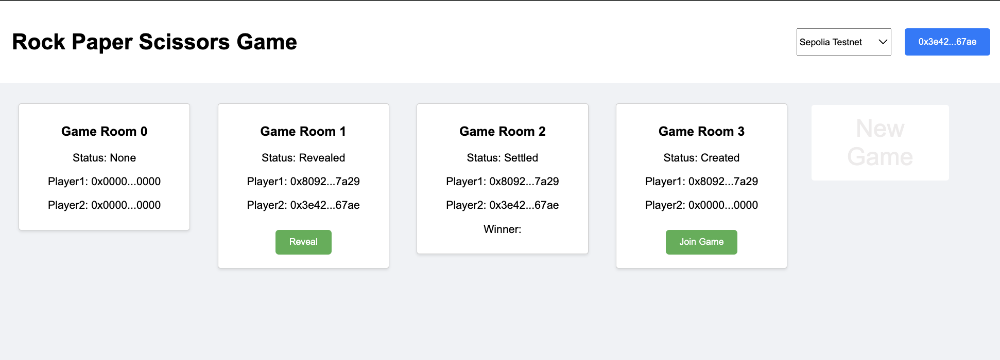

# rock-paper-scissors-frontend

This is a incompleted version for [rock paper scissors game](<https://github.com/tofudfy/rock-paper-scissors.git>), only used for simple demonstration.



## Project setup

Dependencies install:

```sh
npm install
```

Compiles and hot-reloads for development:

```sh
npm run serve
```

## Features

* **Wallet Connnect**: connet to Metamask, select accounts, and switch networks.
* **Create Game**: click the `New Game` button to initiate a new game.
* **Play Game**: click the button at the bottom of the room to join or reveal the game.
* **Check Result**: Winner will be displayed on the finished games.

## Todo Lists

so many...
